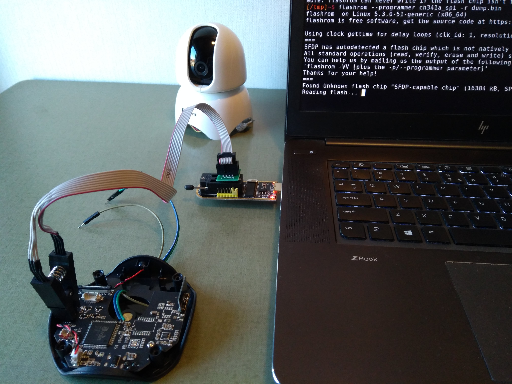
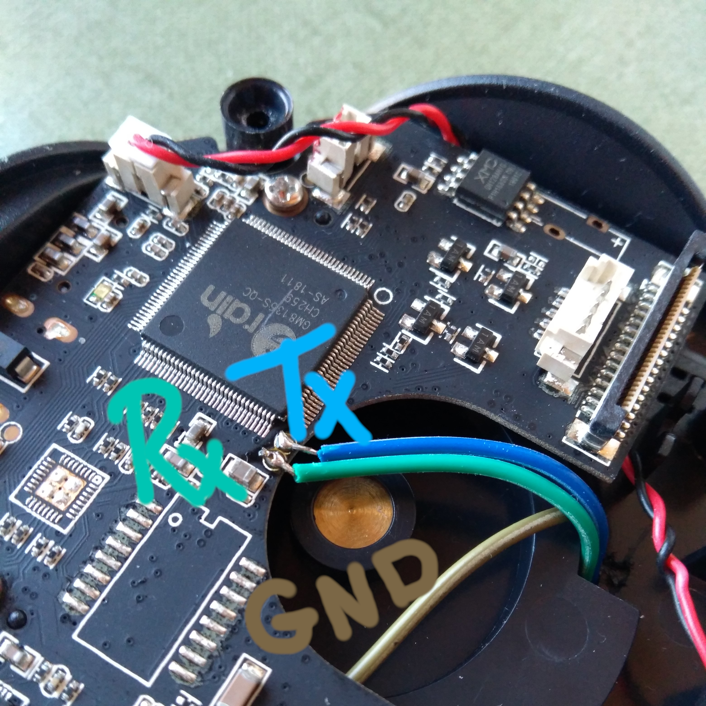
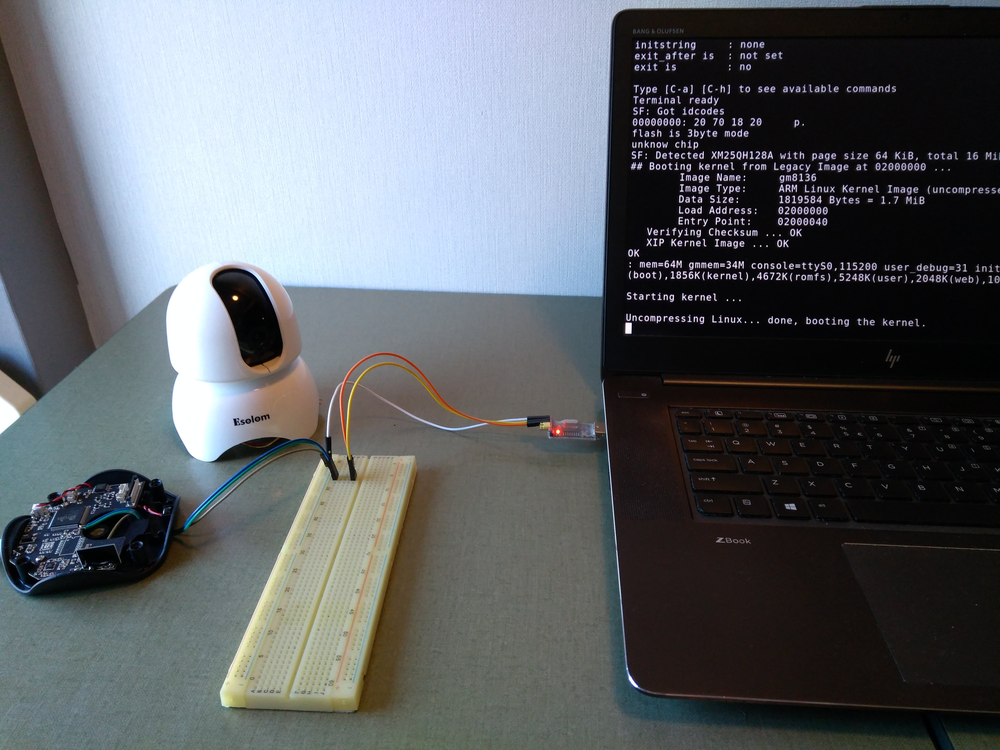

# Background information, W.I.P.

This section is meant for future reference. Some of the techniques we used for this project were new to us, so we wanted a place to document some of the research we did.  

## Technical report
The best place to start would be the [technical report](report.pdf). It covers most techniques we used to develop our final exploit. Some techniques did not make it into the technical report because they were either not necessary for _our_ exploit, or because they turned out to be dead ends.

## Useful info
This section contains random bits of information that were not _required_ for our exploit, but were still useful to figure out how the camera worked.
### Dumping the flash
In our specific case, the camera had a glaring reverse path traversal bug. This allowed us to pull not only the `passwd` file, but also a copy of the _entire_ webserver. In case your device does not have such an issue, a bullet-proof way of getting these files is to "just" dump the flash.  
The process is a bit different for different flash chips. Most of these cheap cameras (like ours) will come equipped with an 8-pin flash chip. These are fairly easy to dump. All you need is a cheap SOP8 test clip + programmer (We used the [KeeYees SOIC8](https://www.amazon.com/KeeYees-SOIC8-EEPROM-CH341A-Programmer/dp/B07SHSL9X9), which costs less than €15).
With the camera unplugged, place the clip over the flash chip, making sure to line up the red wire on the clip with the dot on the chip. Next, connect the programmer to your computer and run
```bash
flashrom --programmer [your_programmer_here] -r dump.bin
```
It might take a few tries to get a solid connection.
  
Finally, you can use binwalk to extract files from your raw flash dump:
```bash
binwalk -Me dump.bin
```
This should give you access to all the password files, secret keys and binaries your heart desires.

### Accessing UART
Most embedded devices will come with a debugging interface. UART is one of the most common options and was also present on our camera. Typically, it can be identified by a row of 3 to 4 contacts in a row. In our case however, the UART connection consisted of 2 _tiny_ contacts near the SoC.


With these wires attached you can connect to your serial port. First measure the voltage (ours was running at 3.3V) and setup your serial connector to use the same voltage. Actually getting into the bootloader requires a bit of trickery. Here's our process:  
1. Plug in the serial port and camera at the same time.
1. Open a serial connection (in our case using `picocom /dev/ttyUSB0 -b 11520`
1. spam `ctrl-c` to cancel the boot process.
When performing these steps in rapid succession (< 2 seconds), you will be greeted by a U-boot command line.


## Redeeming a fallen camera.

Right as we were getting ready to start our recording, we managed to brick our camera. We were not able to fix this within the deadline, but after falling down a rabbit hole we manged to save our camera.  
A full write-up can be found [here](content/redemption.md).
